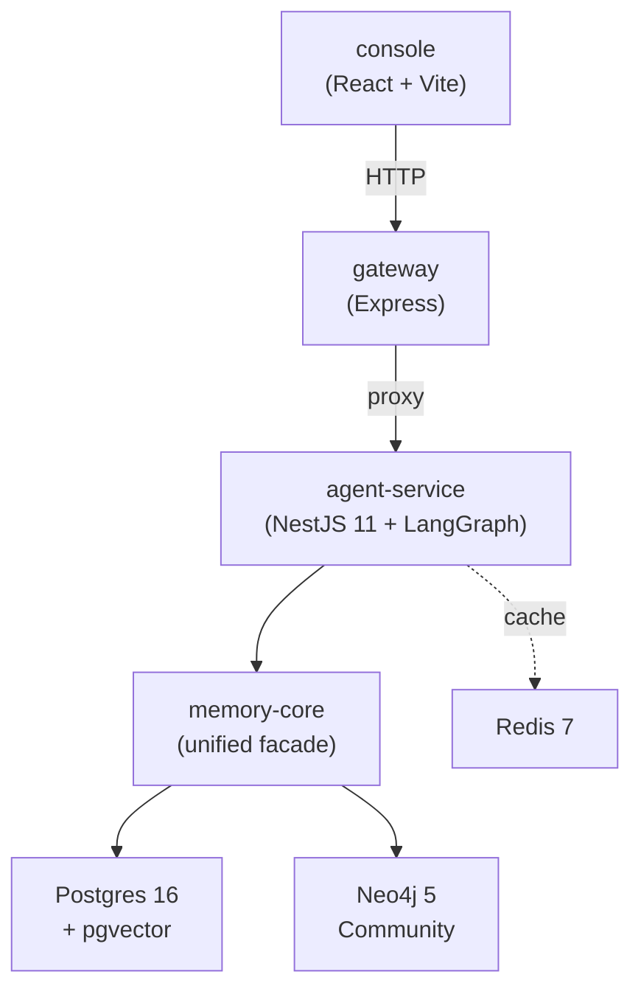
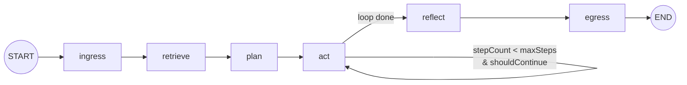
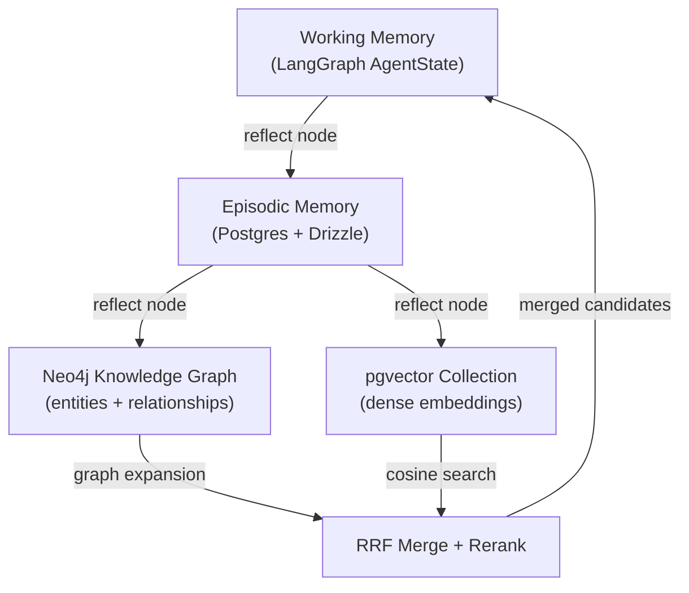

# agent-native-monorepo


> A production-grade chassis for stateful LangGraph agents, purpose-built for multi-agent development workflows.

A Yarn 4 monorepo containing a NestJS 11 microservice that runs a LangGraph state machine with a **Three-Brain memory architecture**: per-run Working Memory, session-scoped Episodic Memory (Postgres + Drizzle ORM), and long-term Semantic Memory combining a Neo4j 5 knowledge graph with pgvector dense embeddings. This project demonstrates the intersection of senior monorepo engineering and production agentic systems: it is an extraction of production patterns from a proprietary platform, sanitized for public consumption.

---

## Architecture

### System Overview



### LangGraph Node Graph



### Three-Brain Memory Model



---

## Why This Exists

This repository is an extraction of production patterns from a proprietary agentic platform, sanitized for public consumption. It is **not** a tutorial, starter kit, or SaaS template.

It exists to demonstrate architectural thinking in two domains that rarely overlap:

1. **Senior monorepo engineering** — Yarn 4 workspaces, Turborepo build orchestration, shared TypeScript configs, contract-first package design with Zod schemas as the source of truth.
2. **Production agentic systems** — LangGraph state machines with crash-safe idempotent writes, hybrid symbolic + dense memory retrieval via Neo4j and pgvector, OpenTelemetry instrumentation at the graph-node level.

The agent's domain logic is intentionally trivial (a single system prompt: _"You are a helpful research assistant."_). The value is in the chassis — how the pieces connect, how memory is structured, how observability is wired, and how the monorepo scales.

---

## Quickstart

```bash
git clone https://github.com/<owner>/agent-native-monorepo
cd agent-native-monorepo
yarn install
docker compose up -d    # Postgres + pgvector, Neo4j, Redis
yarn dev                # Starts all services in dev mode

# Request/response mode
curl -X POST http://localhost:3001/runs \
  -H 'Content-Type: application/json' \
  -d '{"sessionId": "550e8400-e29b-41d4-a716-446655440000", "messages": [{"role": "user", "content": "What is LangGraph?"}]}'

# Streaming mode (SSE)
curl -N -X POST http://localhost:3001/runs/stream \
  -H 'Content-Type: application/json' \
  -d '{"sessionId": "550e8400-e29b-41d4-a716-446655440000", "messages": [{"role": "user", "content": "What is LangGraph?"}]}'
```

### Prerequisites

- Node.js 20.x or 22.x (not required for [Full-Stack Docker](#full-stack-docker))
- Docker and Docker Compose
- A Google AI Studio API key (set `GOOGLE_API_KEY` in `.env`)

Copy `.env.example` to `.env` and fill in your API key:

```bash
cp .env.example .env
```

### Full-Stack Docker

To run the entire stack (infra + all apps) in Docker without Node.js installed:

```bash
cp .env.example .env
# Set GOOGLE_API_KEY in .env

docker compose --profile full up --build
```

| Service       | URL                   |
| ------------- | --------------------- |
| Console       | http://localhost:8080 |
| Gateway       | http://localhost:3001 |
| Agent Service | http://localhost:3000 |
| Neo4j Browser | http://localhost:7474 |

`docker compose up` (without `--profile`) still starts only the infrastructure services for local `yarn dev` development.

---

## Three-Brain Memory

The memory system is divided into three tiers with distinct scopes, persistence strategies, and access patterns.

### Working Memory

Per-run, in-process state held in the LangGraph `AgentState` object. Accumulates intermediate reasoning, tool outputs, and retrieved context. Destroyed at run completion — no external I/O.

### Episodic Memory

Session-scoped turn history persisted in Postgres via Drizzle ORM. Records the full conversation per `session_id` with a configurable TTL (default 90 days). Serves as raw material for Semantic tier promotion.

### Semantic Memory (Hybrid)

> **This is the architectural differentiator.** Long-term memory is maintained across two complementary indices, written atomically by the `reflect` node.

| Index            | Technology | What It Stores                                   | Retrieval Pattern                    |
| ---------------- | ---------- | ------------------------------------------------ | ------------------------------------ |
| Knowledge Graph  | Neo4j 5    | Entities (`:Concept`, `:Fact`) and relationships | Bounded multi-hop Cypher traversal   |
| Dense Embeddings | pgvector   | Distilled fact embeddings (768-dim)              | Cosine similarity via `<=>` operator |

**Why both?** Dense search finds semantically similar facts (paraphrase, synonym variants) but cannot follow relational chains. Graph traversal follows explicit relationships (A→B→C) but misses paraphrase variants. Together, they provide complementary recall paths that reduce false negatives. Results are merged via **Reciprocal Rank Fusion (RRF)**.

---

## LangGraph Node Reference

| Node       | Purpose                         | Key Input Fields               | Key Output Fields           | Side Effects                                 |
| ---------- | ------------------------------- | ------------------------------ | --------------------------- | -------------------------------------------- |
| `ingress`  | Validate request, seed state    | Raw HTTP body                  | Full `AgentState`           | None                                         |
| `retrieve` | Hybrid semantic recall          | `messages`                     | `retrievedContext`          | pgvector query, Neo4j traversal              |
| `plan`     | LLM planning step               | `messages`, `retrievedContext` | `plan`, `tokenCounts`       | LLM API call                                 |
| `act`      | Tool execution loop             | `plan`                         | `toolOutputs`, `stepCount`  | Tool invocations                             |
| `reflect`  | Memory consolidation            | Full state                     | _(none — side-effect node)_ | Episodic write, Neo4j MERGE, pgvector upsert |
| `egress`   | Validate output, build response | Full state                     | `outcome`                   | None                                         |

---

## Contributing

1. Fork the repository and create a feature branch.
2. Read `.context/conventions.md` for code style and naming rules.
3. Follow the step-by-step guides in `.context/workflows.md` for:
   - Adding a new graph node
   - Adding a new package
   - Adding a new memory adapter
4. Use the specialized subagent prompts in `.agents/` if working with AI coding tools.
5. See `AGENTS.md` for cross-tool compatibility notes (Cursor, Kilo Code, Continue, Aider).
6. Run `yarn turbo typecheck && yarn turbo lint` before submitting a PR.
7. Use Conventional Commits: `feat:`, `fix:`, `chore:`, `test:`, `docs:`, `ci:`.
