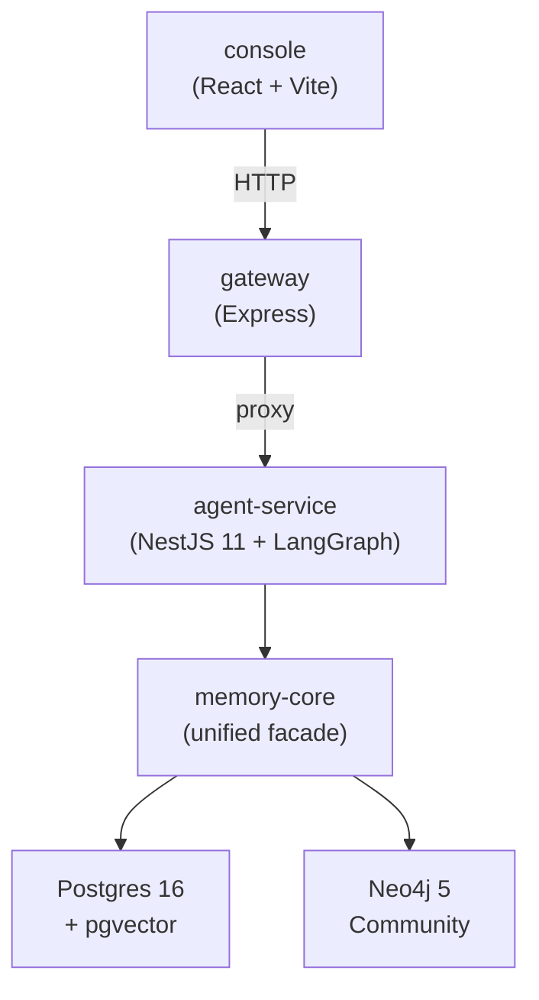
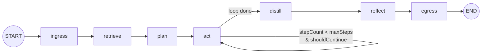
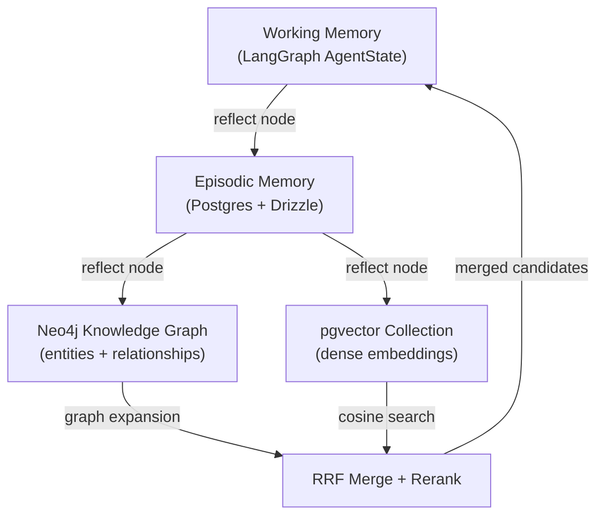

# agent-native-monorepo


> A production-grade chassis for stateful LangGraph agents, purpose-built for multi-agent development workflows.

A Yarn 4 monorepo containing a NestJS 11 microservice that runs a LangGraph state machine designed around a **Three-Brain memory architecture**: per-run Working Memory, session-scoped Episodic Memory (Postgres + Drizzle ORM), and long-term Semantic Memory combining a Neo4j 5 knowledge graph with pgvector dense embeddings. This project demonstrates the intersection of senior monorepo engineering and production agentic systems: it is an extraction of production patterns from a proprietary platform, sanitized for public consumption.

> **What is wired, and what is not.** All three memory tiers are live: `MemoryModule`
> constructs the adapters and `RunsService` injects them, so a run reads from and writes to
> Postgres, Neo4j and pgvector when `DATABASE_URL` and `NEO4J_URI` are set. What this
> repository cannot claim is a gate — `packages/eval-harness` measures the agent and
> `yarn eval` reports the numbers, but no evaluation blocks a merge. P1-C wires evaluation
> into a pipeline, P1-D decides which failures should block.
> [`docs/STATUS.md`](docs/STATUS.md) is the per-capability matrix, and it is the file to
> trust when this README and the code disagree.

---

## Architecture

### System Overview


```mermaid
graph TD
    Console["console<br/>(React + Vite)"]
    Gateway["gateway<br/>(Express)"]
    Agent["agent-service<br/>(NestJS 11 + LangGraph)"]
    Memory["memory-core<br/>(unified facade)"]
    PG["Postgres 16<br/>+ pgvector"]
    Neo["Neo4j 5<br/>Community"]

    Console -->|HTTP| Gateway
    Gateway -->|proxy| Agent
    Agent --> Memory
    Memory --> PG
    Memory --> Neo
```

### LangGraph Node Graph


```mermaid
graph LR
    S((START)) --> ingress
    ingress --> retrieve
    retrieve --> plan
    plan --> act
    act -->|"stepCount < maxSteps<br/>& shouldContinue"| act
    act -->|"loop done"| distill
    distill --> reflect
    reflect --> egress
    egress --> E((END))
```

### Three-Brain Memory Model


```mermaid
graph TD
    WM["Working Memory<br/>(LangGraph AgentState)"]
    EM["Episodic Memory<br/>(Postgres + Drizzle)"]
    Neo4j["Neo4j Knowledge Graph<br/>(entities + relationships)"]
    PGV["pgvector Collection<br/>(dense embeddings)"]
    RRF["RRF Merge + Rerank"]

    WM -->|"reflect node"| EM
    EM -->|"reflect node"| Neo4j
    EM -->|"reflect node"| PGV
    Neo4j -->|"graph expansion"| RRF
    PGV -->|"cosine search"| RRF
    RRF -->|"merged candidates"| WM
```

---

## Why This Exists

This repository is an extraction of production patterns from a proprietary agentic platform, sanitized for public consumption. It is **not** a tutorial, starter kit, or SaaS template.

It exists to demonstrate architectural thinking in two domains that rarely overlap:

1. **Senior monorepo engineering** — Yarn 4 workspaces, Turborepo build orchestration, shared TypeScript configs, and Zod schemas as the single source of truth for every type that crosses a package boundary.
2. **Production agentic systems** — LangGraph state machines, hybrid symbolic + dense memory retrieval via Neo4j and pgvector, OpenTelemetry instrumentation at the graph-node level.

Both lists are wired into the request path. `MemoryModule` constructs the adapters and
`RunsService` injects them, so a run reads from and writes to Postgres, Neo4j and pgvector
when `DATABASE_URL` and `NEO4J_URI` are set, and runs against a stub dependency set when
they are not. The agent is measured, too — `yarn eval` runs live trials and reports `pass@k`
and `pass^k`. What the repository still lacks is a gate on those numbers: P1-C wires
evaluation into a pipeline, P1-D decides which failures should block. See
[`docs/STATUS.md`](docs/STATUS.md) before quoting this section back at the code.

The agent's domain logic is intentionally trivial (a single system prompt: _"You are a helpful research assistant."_). The value is in the chassis — how the pieces connect, how memory is structured, how observability is wired, and how the monorepo scales.

---

## Quickstart

```bash
git clone https://github.com/<owner>/agent-native-monorepo
cd agent-native-monorepo
yarn install
docker compose up -d    # Postgres + pgvector, Neo4j
yarn dev                # Starts all services in dev mode

# Request/response mode
curl -X POST http://localhost:3001/runs \
  -H 'Content-Type: application/json' \
  -d '{"sessionId": "550e8400-e29b-41d4-a716-446655440000", "messages": [{"role": "user", "content": "What is LangGraph?"}]}'

# Streaming mode (SSE)
curl -N -X POST http://localhost:3001/runs/stream \
  -H 'Content-Type: application/json' \
  -d '{"sessionId": "550e8400-e29b-41d4-a716-446655440000", "messages": [{"role": "user", "content": "What is LangGraph?"}]}'
```

### Prerequisites

- Node.js 24.x (not required for [Full-Stack Docker](#full-stack-docker))
- Docker and Docker Compose

Both quickstart curls above work against a fresh clone with no `.env` at all: with no
`GOOGLE_API_KEY` set, the service runs the graph against a deterministic stub dependency
set, which is also what CI exercises.

Memory is a second, independent axis. Set `DATABASE_URL` and `NEO4J_URI` — as
`docker compose --profile full` does — and the service constructs the real adapters, runs
its migrations, installs the Neo4j constraints and checkpoints every run. Set neither and
it runs against deterministic stubs. Set one without the other and it refuses to start,
because falling back to no-op writers when a configured database is missing is how a
system quietly stops persisting anything.

Copy `.env.example` to `.env` if you want to point the service at your own infrastructure:

```bash
cp .env.example .env
```

The service reads that file at boot. A variable already set in the environment still wins —
which is what a container, a CI runner and a secrets manager all assume — so a long-lived
`export GOOGLE_API_KEY=...` in a shell rc file will quietly outrank the file you just
edited. Boot names any variable in that state: look for `env.file.shadowed` in the log,
which lists the variable names whose `.env` values are not in use.

### Full-Stack Docker

To run the entire stack (infra + all apps) in Docker without Node.js installed:

```bash
docker compose --profile full up --build
```

| Service       | URL                   |
| ------------- | --------------------- |
| Console       | http://localhost:8080 |
| Gateway       | http://localhost:3001 |
| Agent Service | http://localhost:3000 |
| Neo4j Browser | http://localhost:7474 |

`docker compose up` (without `--profile`) still starts only the infrastructure services for local `yarn dev` development.

---

## Three-Brain Memory

The memory system is three tiers with distinct scopes, persistence strategies, and access patterns, and all three are live. Working Memory is in-process. The other two are implemented in `packages/memory-core`, covered by integration tests against real Postgres and Neo4j, and constructed by `apps/agent-service`: `MemoryModule` builds the pool, the driver, the four adapters and the retrieval facade, and `RunsService` injects them by token. A run reads from and writes to Postgres, Neo4j and pgvector when `DATABASE_URL` and `NEO4J_URI` are set, and runs against a deterministic stub dependency set when they are not — memory and model are independent axes, and neither falls back. Per-capability detail is in [`docs/STATUS.md`](docs/STATUS.md).

### Working Memory

Per-run, in-process state held in the LangGraph `AgentState` object. Accumulates intermediate reasoning, tool outputs, and retrieved context. Destroyed at run completion — no external I/O.

### Episodic Memory

Session-scoped turn history persisted in Postgres via Drizzle ORM. Records the full conversation per `session_id` — both sides of it: `plan` appends the assistant's turn to `state.messages` before `reflect` persists them. Serves as raw material for Semantic tier promotion.

Retention is unbounded: there is no expiry column and no cleanup job. Writes upsert on the `(session_id, turn_index)` natural key, so a replayed run — or a re-sent history under a fresh `run_id` — lands on the same rows. First write wins, which makes the log a record of what was first seen rather than a mirror of the client's current history.

### Semantic Memory (Hybrid)

> **This is the intended architectural differentiator.** Long-term memory is designed to span two complementary indices, both written by the `reflect` node.

The `reflect` node writes Postgres, then Neo4j, then pgvector, in three sequential loops. Each write is replay-safe — the episodic natural key, Cypher `MERGE`, and pgvector upsert on a content hash — and `reflect` reads its extraction from state rather than deriving it, so a retried attempt writes exactly what the first attempt wrote. The three are still not atomic together: a crash between them leaves the indices disagreeing until the retry, not permanently. That guarantee is convergence under replay, not exactly-once; [ADR 0001](docs/adr/0001-langgraph-over-a-durable-execution-engine.md) explains why the stronger one was not bought, and an outbox would be a new PRD.

| Index            | Technology | What It Stores                                   | Retrieval Pattern                    |
| ---------------- | ---------- | ------------------------------------------------ | ------------------------------------ |
| Knowledge Graph  | Neo4j 5    | Entities (`:Concept`, `:Fact`) and relationships | Bounded multi-hop Cypher traversal   |
| Dense Embeddings | pgvector   | Distilled fact embeddings (768-dim, HNSW)        | Cosine similarity via `<=>` operator |

**Why both?** Dense search finds semantically similar facts (paraphrase, synonym variants) but cannot follow relational chains. Graph traversal follows explicit relationships (A→B→C) but misses paraphrase variants. Together, they provide complementary recall paths that reduce false negatives. The reasoning is recorded in [ADR 0002](docs/adr/0002-neo4j-and-pgvector-rather-than-one-store.md), which also notes that the premise is unmeasured until P2-B builds the ablation.

Results merge via **Reciprocal Rank Fusion (RRF)**, keyed on the fact's content hash. This used to interleave rather than fuse, and the reason was not the key: the graph returned `:Concept` nodes while pgvector returned facts, and two lists drawn from disjoint universes cannot intersect under any key. The graph now stores facts too — `(:Fact)-[:MENTIONS]->(:Concept)`, keyed on the same hash — so traversal reaches the same objects vector search returns, and a fact found by both paths is scored at the sum of its two reciprocal ranks. [ADR 0004](docs/adr/0004-one-candidate-universe-for-fusion.md) records the decision.

Retrieval is scoped to the requesting session by default, with an explicit `crossSession` opt-out.

---

## LangGraph Node Reference

`distill` and `reflect` are separate nodes so that `reflect` can carry a retry policy. A
node is only safe to retry when it is a function of its input state, and a `reflect` that
extracted its own entities was not: a second attempt could word a fact differently, change
its hash, and write an extra row rather than converging on the first attempt's.

| Node       | Purpose                         | Key Input Fields               | Key Output Fields                        | Side Effects                                  |
| ---------- | ------------------------------- | ------------------------------ | ---------------------------------------- | --------------------------------------------- |
| `ingress`  | Validate request, seed state    | Raw HTTP body                  | Full `AgentState`                        | None                                          |
| `retrieve` | Hybrid semantic recall          | `messages`, `topK`, `hopDepth` | `retrievedContext`                       | pgvector search, Neo4j traversal              |
| `plan`     | LLM planning step               | `messages`, `retrievedContext` | `currentPlan`, `messages`, `tokenCounts` | LLM API call                                  |
| `act`      | Tool execution loop             | `currentPlan`                  | `toolOutputs`, `stepCount`               | Tool invocations                              |
| `distill`  | Extract entities and facts      | `messages`                     | `extraction`                             | LLM API call                                  |
| `reflect`  | Memory consolidation            | `messages`, `extraction`       | _(none — side-effect node)_              | Episodic insert, Neo4j MERGE, pgvector upsert |
| `egress`   | Validate output, build response | Full state                     | `outcome`                                | None                                          |

---

## Contributing

1. Fork the repository and create a feature branch.
2. Read `.context/conventions.md` for code style and naming rules, and `docs/STATUS.md`
   before adding a sentence that describes what the system does.
3. For non-trivial work, start with a PRD — see `docs/prd/README.md` for the backlog and
   `.context/workflows.md` for the flow. Decisions are recorded in `docs/adr/`.
4. Follow the step-by-step guides in `.context/workflows.md` for:
   - Adding a new graph node
   - Adding a new package
   - Adding a new memory adapter
5. Use the specialized subagent prompts in `.agents/` if working with AI coding tools.
6. See `AGENTS.md` for cross-tool compatibility notes (Cursor, Kilo Code, Continue, Aider).
7. Run `yarn turbo typecheck && yarn turbo lint` before submitting a PR.
8. Use Conventional Commits: `feat:`, `fix:`, `chore:`, `test:`, `docs:`, `ci:`.
